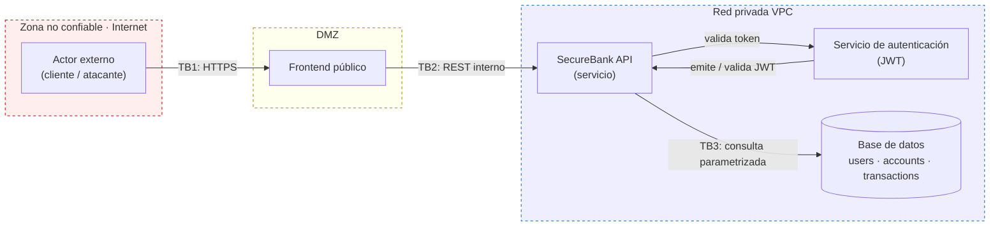

# Threat Model · SecureBank API

**Proyecto:** SecurePipeline · UBO Ingeniería Informática · Sistemas Automatizados DevSecOps
**Entregable de:** Sesión 03 — Threat Modeling y Requisitos de Seguridad
**Formato de entrega:** tabla en Markdown · DFD anexo · una security story por cada amenaza (ver `security-stories.md`)
**Fecha de próxima revisión:** al cierre de cada sesión del curso, cuando el pipeline incorpora una capa nueva de seguridad (SAST → Sesión 5, SCA → Sesión 6, DAST → Sesión 7).

## 1. Contexto

SecureBank API es una plataforma financiera simulada, deliberadamente
vulnerable, usada como laboratorio didáctico. Mueve dinero simulado:
cada endpoint es una superficie de ataque. Módulos funcionales:
Autenticación (login · JWT · sesión), Cuentas (consulta de saldos),
Transferencias (`POST /transfer`), Usuarios (registro y perfil),
Movimientos (historial e informes transaccionales).

Regla de negocio: modelar amenazas en diseño es ~10× más barato que
corregirlas en producción — el fallo típico en banca es BOLA (OWASP
API Security Top 10 · #1).

## 2. Data Flow Diagram (DFD)

Tres fronteras de confianza (trust boundaries), marcadas con línea
punteada azul en la notación original del curso:

- **TB1** — Internet ↔ Frontend público
- **TB2** — DMZ ↔ API interna (zona pública ↔ red interna VPC)
- **TB3** — API ↔ Red privada / base de datos

**Regla de oro:** toda vez que un dato cruza una frontera de confianza
→ hay que validar entrada, autenticar origen y autorizar la acción.

**Attack surface incluida:** endpoints REST expuestos (`/login`,
`/register`, `/accounts/{id}`, `/transfer`, `/export`, `/welcome`,
`/calc/rate`), formularios del frontend, puerto de la base de datos,
servicio de autenticación, contenedores e imágenes Docker,
dependencias de terceros, variables de entorno y secretos.

## 3. Vocabulario aplicado

| Término | Definición | Ejemplo en SecureBank |
|---|---|---|
| Activo | Lo que tiene valor y debe protegerse | Datos de clientes, saldos, tokens JWT, infraestructura |
| Amenaza | Evento potencial que puede dañar el activo | Atacante intenta transferir fondos de una cuenta ajena |
| Vulnerabilidad | Debilidad que permite concretar la amenaza | Endpoint no valida propiedad de la cuenta origen |
| Riesgo | Probabilidad × Impacto de la amenaza materializada | Determina la prioridad de mitigación |
| Control | Medida preventiva, detectiva o correctiva | MFA, autorización por recurso, cifrado, rate limiting, SAST/DAST |

Fórmula base: **Riesgo = Probabilidad × Impacto**. Prioridad de
mitigación = riesgos ALTOS primero; un riesgo BAJO×BAJO puede
aceptarse formalmente.

## 4. Threat Model — mínimo 10 amenazas (STRIDE)

| # | STRIDE | Amenaza | Descripción | Riesgo | Control propuesto | Estado |
|---|--------|---------|-------------|--------|---------------------|--------|
| 01 | S | Suplantación por credenciales robadas | Credential stuffing con listas filtradas contra `/login` | ALTO | MFA obligatorio · política de contraseñas + monitoreo de credenciales filtradas | Parcial — falta MFA |
| 02 | S | Falsificación de JWT | Token generado con clave débil o `alg: none` | ALTO | Firma con algoritmo fijado (rechazo explícito de `none`) · claves rotadas · migración a RS256 | Implementado (`auth.decode_token`) |
| 03 | T | Manipulación del monto en tránsito | MITM modifica `amount` de la petición hacia `/transfer` | MEDIO | HTTPS obligatorio · HSTS · certificate pinning en cliente móvil | HSTS activo (`app.py`) — pinning pendiente (fuera de alcance API) |
| 04 | T | SQL Injection en `/login` y `/accounts` | Parámetros concatenados directamente en consultas SQL | ALTO | Prepared statements · ORM parametrizado · SAST en el pipeline | Implementado (`users.py`) + verificado con Semgrep |
| 05 | R | Repudio de transferencias | Cliente niega una transferencia; no hay log íntegro que lo pruebe | MEDIO | Audit log inmutable con sello de tiempo · trazabilidad por userId | Implementado (`db.log_event`) — WORM storage pendiente en infra |
| 06 | I | Exposición de datos vía IDOR | `GET /accounts/{id}` permite ver saldos ajenos cambiando el id | ALTO | Autorización por recurso · pruebas de autorización en CI | Implementado (`accounts.py`) + test `test_account_access_forbidden_for_non_owner` |
| 07 | I | Fuga de secretos en repositorio | Claves de BD y JWT commiteadas en `.env` | MEDIO | Vault/KMS · git-secrets en pre-commit · rotación tras incidente | `JWT_SECRET` vía variable de entorno, nunca en el repo |
| 08 | D | Fuerza bruta contra `/login` | Bots agotan CPU y bloquean logins legítimos | MEDIO | Rate limiting por IP+usuario · CAPTCHA tras N intentos · WAF | Implementado (`auth.is_rate_limited`, 5 intentos/60s) |
| 09 | D | Payload masivo a `/transfer` | Cuerpo JSON de 100 MB satura el parser | BAJO | Límite de tamaño de request · timeouts · circuit breaker | Pendiente — configurar `MAX_CONTENT_LENGTH` en despliegue |
| 10 | E | BOLA en `/transfer` | Backend acepta `originAccount` sin validar propiedad (caso analizado) | ALTO | Validar userId vs. dueño de la cuenta · 403 + log · tests de autorización | Implementado (`transfer.py`) + test `test_transfer_blocked_for_non_owner_account_bola` |
| 11 | E | Escalada a rol admin | Cliente altera el claim `role` del JWT | ALTO | RBAC del lado servidor · validar firma y expiración del JWT · mínimo privilegio | Firma validada server-side (`decode_token`); rol nunca confiado del cliente |
| 12 | I | Logs con datos sensibles | Tokens, RUT y saldos en texto plano en logs | MEDIO | Redacción/enmascaramiento de PII · retención acotada · acceso auditado | Pendiente — política de redacción de logs en infra |

## 5. STRIDE aplicado — mapa de referencia

| STRIDE | Endpoint / vector | Ejemplo concreto |
|---|---|---|
| **S**poofing | `POST /login` | Credenciales filtradas usadas para hacerse pasar por un cliente real |
| **T**ampering | `POST /transfer` | Interceptar y modificar `amount` antes de llegar al backend |
| **R**epudiation | Logs sin firma | Usuario niega una transferencia; sin auditoría íntegra el banco no puede probarlo |
| **I**nformation Disclosure | `GET /accounts/{id}` | Respuesta expone RUT/saldo de cualquier cuenta cambiando el `{id}` |
| **D**enial of Service | `POST /login` | Bot sin rate limiting agota recursos del servicio de autenticación |
| **E**levation of Privilege | JWT `{"role": "admin"}` | Cliente edita el claim `role` si el backend no valida la firma |

## 6. Caso de análisis — `POST /transfer` (BOLA)

- **Amenaza detectada:** BOLA — Broken Object Level Authorization (OWASP API #1)
- **Escenario de abuso:** un atacante autenticado como cliente B envía `originAccount: "1001"` (cuenta de A). Si el backend no comprueba propiedad, ejecuta la transferencia.
- **Control esperado:** extraer `userId` del JWT firmado → consultar dueño de `originAccount` → si `userId ≠ owner`, responder `403 Forbidden` + log del intento.
- **Mapeo STRIDE:** Elevation of Privilege.
- **Security story asociada:** ver `security-stories.md`, historia SEC-010.
- **Estado:** implementado en `securebank_api/transfer.py`, cubierto por `tests/test_basic.py::test_transfer_blocked_for_non_owner_account_bola`.

## 7. Idea fuerza

> "Modelar amenazas en la fase de diseño es 10× más barato que
> corregirlas en producción. Es el primer commit del pipeline
> DevSecOps."
